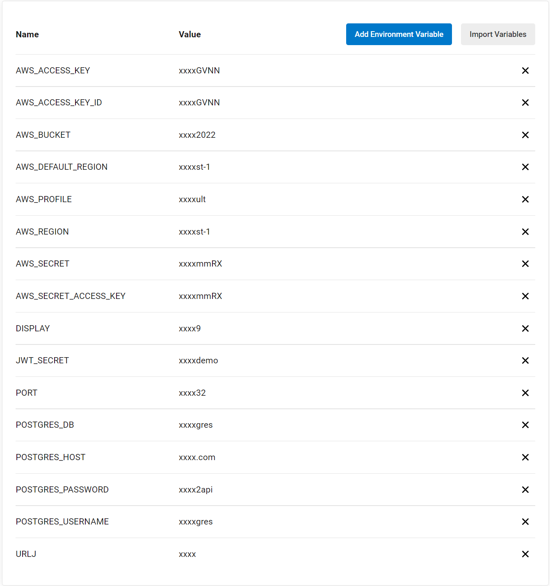
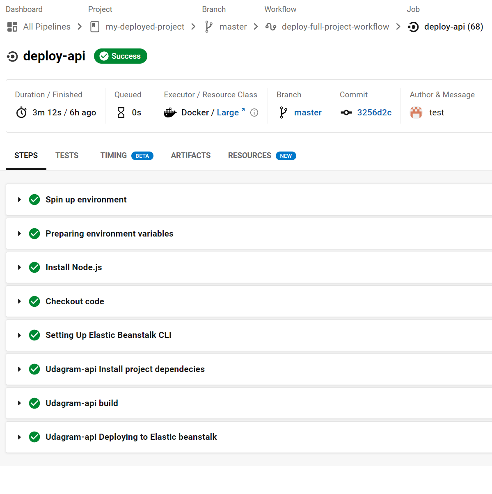
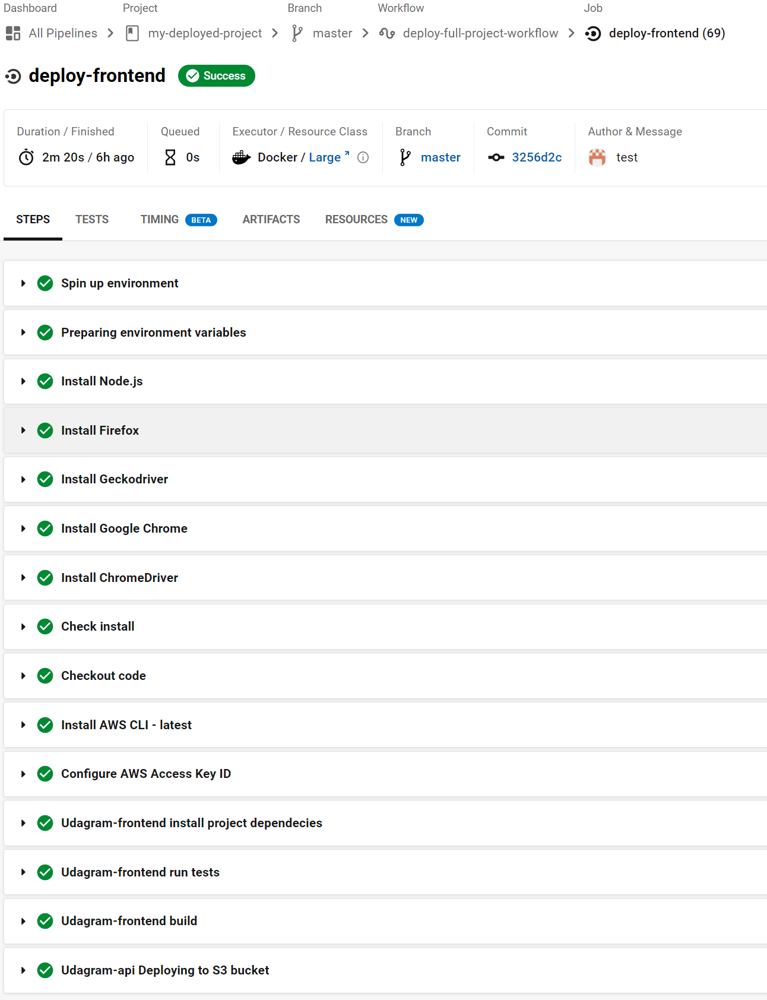
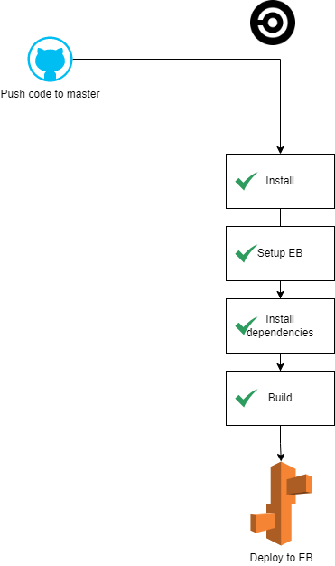
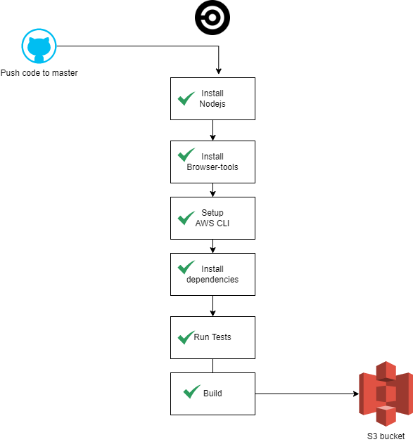

# CI/CD Software
My-deployed-project is implemented with CircleCI. A great aplication to automate the build, test and deploy. It is configure whenever there is commit in the code to **master** branch.

Before pipeline process starts, this configuration should be completed:
1. CircleCI should be connected with github repo.
2. A database should be hosted in AWS RDS.
3. S3 bucket created.
4. Project variable set.

Create the following enviroment variables:

### Pipeline
Orbs:
* node: circleci/node@5.0.0
* aws-cli: circleci/aws-cli@2.1.0
* aws-elastic-beanstalk: circleci/aws-elastic-beanstalk@2.0.1
* browser-tools: circleci/browser-tools@1.2.4

Jobs:

* deploy-api
* deploy-frontend

Steps:
* deploy-api:
  1. Install nodejs
  2. Setup Elastic beanstalk
  3. Run install script
  4. Run build script
  5. Run deploy script

* deploy-frontend:
  1. Install nodejs
  2. Install browser-tools to run tests
  3. Setup AWS CLI
  4. Run install dependecies script
  5. Run unit test script
  6. Run build script
  7. Run deploy script

## Diagram Backend

## Diagram Frontend

Return to [Process](Process.md).