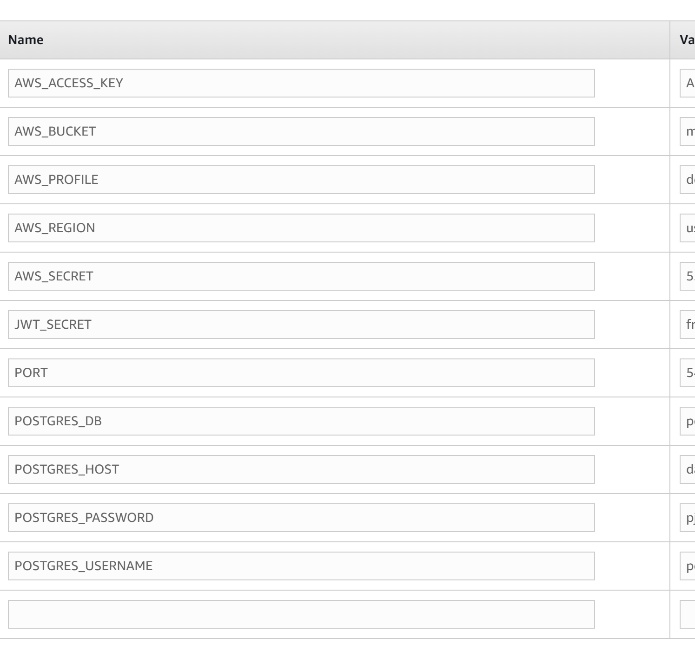

#Cloud Software Deployment

This project is using AWS services. AWS provides a massive global cloud infrastructure that allows to quickly innovate, experiment and iterate.

###Services

The AWS serices selected for this project are RDS, Elastic beanstalk and S3 bucket.

####RDS

Amazon Relational Database Service (RDS) is a collection of managed services that makes it simple to set up, operate, and scale databases in the cloud.

This service is used by udagram-api to save/fetch data.

Details:

Dashboard:

Configuration:

It is a postgres database and it was configured as a micro database to save costs. It is using 12.9 engine version.

####Elastic beanstalk
AWS Elastic Beanstalk is an easy-to-use service for deploying and scaling web applications and services.

This services is to host api application. And is configured to use Node.js 16 running on 64bit Amazon Linux 2.

Here is the actual heath status:

This service require a enviroment variable configuration to make it work, here is a list of the required variables:

####S3 bucket
Amazon S3 is cloud object storage with industry-leading scalability, data availability, security, and performance.

This service is used to host udagram-frontend. Its configuration is set with public access, this service is useful for static webs because is easy to use and manage.

Return to [Process](Process.md).