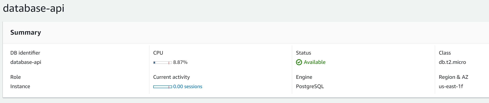
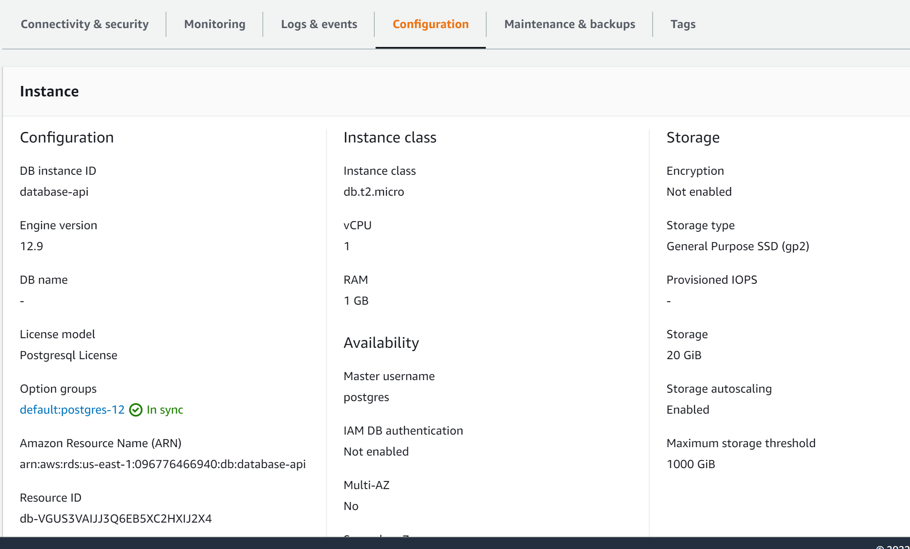
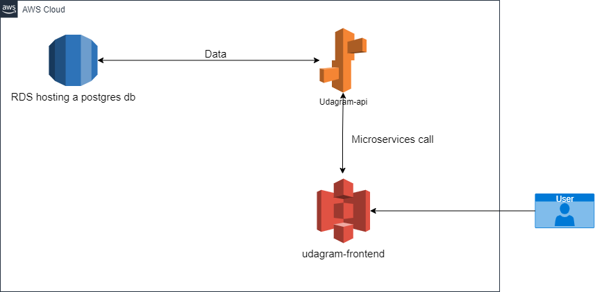

# Infrastructure
My-deployed-project includes the following infrastructure:

### udagram-api
Database: Postgres version 12.9 hosted in RSD.

Configuration:

Hosted: Elastic beanstalk

### udagram-frontend
A simple website hosted in S3 bucket. It consumes udagram-api data.

#### Architecture Diagram

Return to [Process](Process.md).

